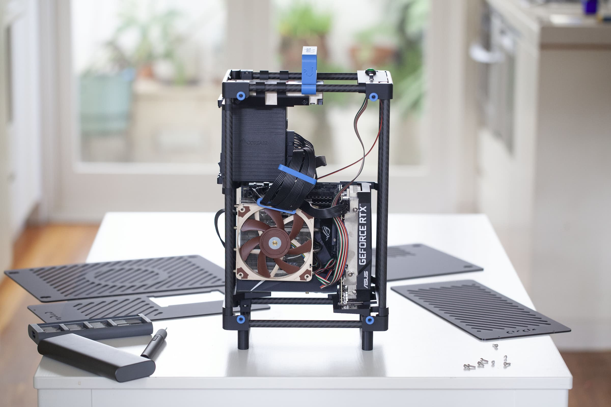
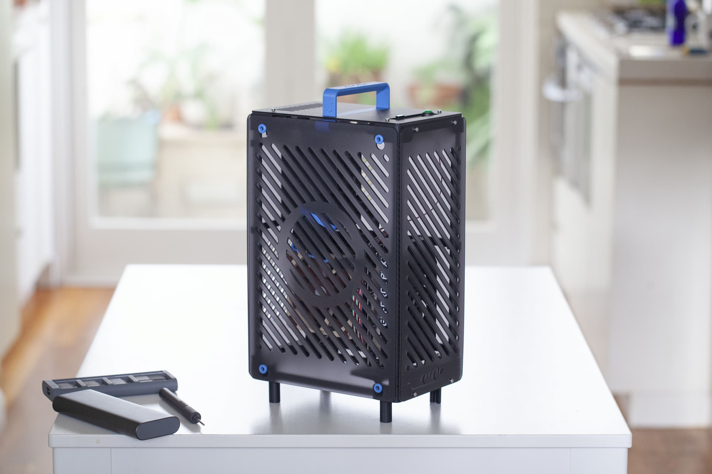

<!-- PROJECT LOGO -->
 

  

  <h3 align="center">Space Case: Makers Edition</h3>

  

    A 3D printable mini-itx case platform maintained by Circle Studio. 
  

<!-- ABOUT THE PROJECT -->
## About

The Space Case is a mini-itx case that is easy to build at home with a 3d printer and off-the-shelf components. 

It features:

* Full length 3-slot GPU support up to 330mm long.
* Riser-card free design (reduces compatibility issues and cost). 
* up to 280mm radiator support. 
* CPU cooler height up to 149mm. 
* SFX PSU support.
* 3.5" HDD support. 
* GPU and mobo I/O egress from base of the case. 
* Optional I/O panel at the top of the case. 
* Convenient & sturdy handle.
* 16.7 litres.

<!-- GET STARTED -->
## How to build

**NOTE: The design is currently in beta testing. Be prepared to tinker.**   

* Step 1: Source components. Component list is [here.](04_COMPONENTS/COMPONENT_LIST.md) 
* Step 2: Print the [parts.](02_3D%20PRINT%20FILES/) 
* Step 3: (Optional) Source laser cut panels using [these cut files.](03_LASER%20CUT%20FILES/)
* Step 4: Assemble. Guide coming soon. 
* Step 5: Enjoy your new case!

 

